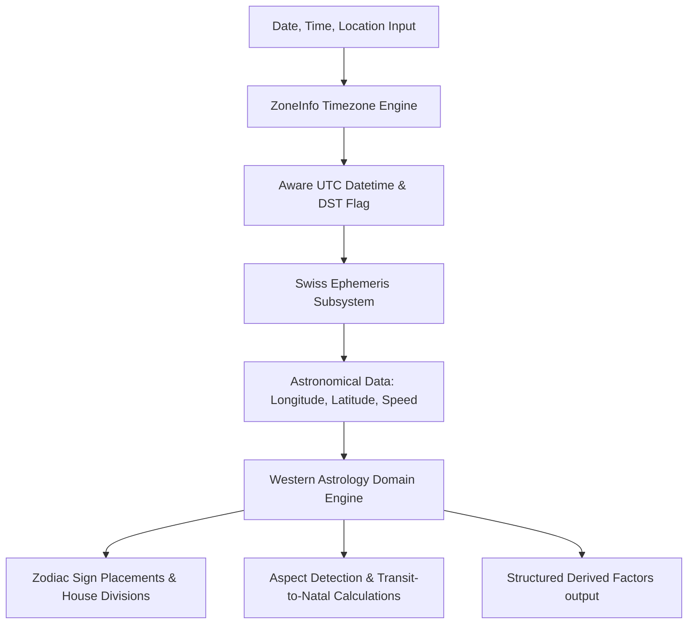

# Western Astrology Calculations & Domain Engine Methodology

This document outlines the architecture, mathematical formulations, configuration options, and licensing terms for the deterministic astronomical calculation subsystem and the isolated Western Astrology domain engine.

---

## 1. Subsystem Architecture

The system is structured in two isolated layers to maintain clear boundaries between physical astronomical calculations and astrological domain rules:

---

## 2. Astronomical Calculations Subsystem (Phase 3)

### Timezone Conversion & DST Resolution
- Local coordinates/times are converted to UTC via Python's standard `zoneinfo` module accessing the IANA database.
- DST state is determined dynamically using the `dst()` offset from the aware local datetime.
- Exact UTC datetime is transformed to Julian Day (UT) using the standard Swiss Ephemeris formulation:
  $$\text{Julian Day} = f(\text{Year}, \text{Month}, \text{Day}, \text{Hour Decimal})$$

### Ephemeris Computation (`pyswisseph`)
- Planetary coordinates are calculated using the Swiss Ephemeris library.
- Calculations return the ecliptic longitude, latitude, and speed in longitude.
- **Retrograde State**: A planet is defined as retrograde ($\mathcal{R}$) if its speed in longitude is less than zero:
  $$\text{is\_retrograde} = (\text{speed\_longitude} < 0)$$
- **South Node Derivation**: The South Node ($\text{SN}$) is mathematically defined as exactly $180^\circ$ opposite to the North Node ($\text{NN}$):
  $$\text{SN}_{\text{longitude}} = (\text{NN}_{\text{longitude}} + 180.0) \pmod{360.0}$$
  $$\text{SN}_{\text{latitude}} = -\text{NN}_{\text{latitude}}$$

---

## 3. Western Astrology Domain Engine (Phase 4)

The domain engine consumes astronomical coordinates and maps them to Western astrological structures.

### Zodiac Placements (Tropical Zodiac)
- The ecliptic is divided into 12 equal signs of $30^\circ$ starting at the vernal equinox ($0^\circ$ Aries):
  $$\text{sign\_index} = \lfloor \frac{\text{longitude}}{30} \rfloor$$
  $$\text{degree\_in\_sign} = \text{longitude} \pmod{30}$$

### House Division
- **Placidus / Koch Systems**: Calculated directly using `swisseph.houses`.
- **Whole Sign System**: The first house cusp is defined as $0^\circ$ of the sign containing the Ascendant. Each subsequent house is the full $30^\circ$ sign that follows.
- **Circular Containment**: Planets are assigned to houses by checking if their longitude $\theta$ lies between house cusp $H_k$ and $H_{k+1}$ using a circular wrap-around helper:
  $$\text{is\_angle\_between}(\theta, H_k, H_{k+1})$$

### Major Aspects & Orb Computation
We compute the angular distance between two planetary longitudes $\theta_1$ and $\theta_2$:
$$\Delta \theta = \min(|\theta_1 - \theta_2|, 360.0 - |\theta_1 - \theta_2|)$$

Aspects are matched based on the following configurations:

| Aspect | Target Angle | Default Orb Limit | Formula |
| :--- | :---: | :---: | :--- |
| **Conjunction** | $0^\circ$ | $8.0^\circ$ | $|\Delta \theta - 0^\circ| \le 8.0^\circ$ |
| **Sextile** | $60^\circ$ | $6.0^\circ$ | $|\Delta \theta - 60^\circ| \le 6.0^\circ$ |
| **Square** | $90^\circ$ | $8.0^\circ$ | $|\Delta \theta - 90^\circ| \le 8.0^\circ$ |
| **Trine** | $120^\circ$ | $8.0^\circ$ | $|\Delta \theta - 120^\circ| \le 8.0^\circ$ |
| **Opposition** | $180^\circ$ | $8.0^\circ$ | $|\Delta \theta - 180^\circ| \le 8.0^\circ$ |

#### Aspect Strength
The aspect strength is normalized linearly between $1.0$ (exact alignment) and $0.0$ (at the maximum orb boundary):
$$\text{strength} = 1.0 - \left( \frac{\text{computed\_orb}}{\text{max\_orb}} \right)$$

---

## 4. Licensing Assumptions

The Swiss Ephemeris is published under the GNU General Public License (GPL v2 or later) or a proprietary license. 
1. **GPL compliance**: Because this project uses the `pyswisseph` binding library (which links to the Swiss Ephemeris C-source), the application code in a production environment should either be licensed under GPL or satisfy the conditions of the Swiss Ephemeris commercial licensing model if distributed closed-source.
2. **Ephemeris Files**: This engine uses the built-in Moshier semi-analytical ephemeris by default, but supports loading high-precision JPL DE431/DE441 ephemeris files (in `.se1` format) when configured via `ephe_path`.

---

## 5. Numerology Subsystem Methodology (Phase 6)

### System Specification & Versioning
- **Methodology**: Western Pythagorean Numerology System (`Pythagorean Numerology System`)
- **Engine Version**: `1.0.0`
- **Isolation Policy**: Numerology systems are never silently mixed or combined with Chaldean, Vedic (Kabbalistic), or other non-Pythagorean systems.

### Letter-to-Number Pythagorean Mapping
The Pythagorean system maps standard Latin alphabetic characters (A-Z) to integers $1$ through $9$ cyclically:

| Value | Letters |
| :--- | :--- |
| **1** | A, J, S |
| **2** | B, K, T |
| **3** | C, L, U |
| **4** | D, M, V |
| **5** | E, N, W |
| **6** | F, O, X |
| **7** | G, P, Y |
| **8** | H, Q, Z |
| **9** | I, R |

### Letter Classification
- **Vowels**: Standard English vowels $\mathcal{V} = \{ \text{A, E, I, O, U} \}$
- **Consonants**: All remaining alphabetic characters $\mathcal{C} = \{ \text{B, C, D, F, G, H, J, K, L, M, N, P, Q, R, S, T, V, W, X, Y, Z} \}$

### Master Numbers & Digit Reduction
- **Master Numbers**: $\mathcal{M} = \{ 11, 22, 33 \}$ are preserved and not reduced further during intermediate component reduction or final sum reduction when master number preservation is active.
- **Reduction Function**: Given an integer $n \in \mathbb{N}$:
  $$\text{reduce}(n) = \begin{cases} n & \text{if } n \le 9 \text{ or } (n \in \mathcal{M} \text{ and preserve\_master=True}) \\ \text{reduce}\left(\sum_{d \in \text{digits}(n)} d\right) & \text{otherwise} \end{cases}$$

### Core Calculations

1. **Life Path Number**:
   - Given birth date $\text{DOB} = (\text{Year}, \text{Month}, \text{Day})$:
   - Intermediate reductions:
     $$m = \text{reduce}(\text{Month}), \quad d = \text{reduce}(\text{Day}), \quad y = \text{reduce}(\text{Year})$$
   - Final value:
     $$\text{LifePath} = \text{reduce}(m + d + y)$$

2. **Birthday Number**:
   - Given day of birth $D \in [1, 31]$:
     $$\text{BirthdayNumber} = \text{reduce}(D)$$

3. **Personal Year**:
   - Given birth date $\text{DOB} = (\text{Year}, \text{Month}, \text{Day})$ and target year $Y_{\text{target}}$:
     $$m = \text{reduce}(\text{Month}), \quad d = \text{reduce}(\text{Day}), \quad y_t = \text{reduce}(Y_{\text{target}})$$
     $$\text{PersonalYear} = \text{reduce}(m + d + y_t)$$

4. **Personal Month**:
   - Given $\text{PersonalYear}$ and target month $M_{\text{target}} \in [1, 12]$:
     $$m_t = \text{reduce}(M_{\text{target}})$$
     $$\text{PersonalMonth} = \text{reduce}(\text{PersonalYear} + m_t)$$

5. **Destiny / Expression Number**:
   - Given validated full name letters $L = [c_1, c_2, \dots, c_k]$:
     $$\text{Destiny} = \text{reduce}\left( \sum_{i=1}^{k} \text{PythagoreanValue}(c_i) \right)$$

6. **Soul Urge (Heart's Desire)**:
   - Given validated full name vowels $V = [v \in L \mid v \in \mathcal{V}]$:
     $$\text{SoulUrge} = \text{reduce}\left( \sum_{v \in V} \text{PythagoreanValue}(v) \right)$$

7. **Personality Number**:
   - Given validated full name consonants $C = [c \in L \mid c \in \mathcal{C}]$:
     $$\text{Personality} = \text{reduce}\left( \sum_{c \in C} \text{PythagoreanValue}(c) \right)$$

### Output Specification
All calculations return deterministic structured objects adhering strictly to `NumerologyCalculationResult`:
- `calculated_value`: The integer single-digit or master number result.
- `methodology`: Explicit formulation description under the Pythagorean Numerology System.
- `source_input`: The normalized input string.
- `calculation_steps`: Array of string representations detailing each intermediate sum and reduction step.
- `engine_version`: Version identifier of the calculation engine (e.g. `1.0.0`).

---

## 6. Image Intelligence Subsystem Methodology (Phase 7)

This section details the deterministic computer vision, OCR, layout extraction, and security architecture for astrological Kundli and chart uploads.

### Processing Pipeline
The image intelligence pipeline executes in strict sequential stages:
$$\text{Upload} \longrightarrow \text{File Validation} \longrightarrow \text{Preprocessing} \longrightarrow \text{Chart-Type Detection} \longrightarrow \text{Vision Layout} \longrightarrow \text{OCR} \longrightarrow \text{Chart Extraction} \longrightarrow \text{Astrological Validation} \longrightarrow \text{Confidence Scoring}$$

### Chart Topologies & Layouts
1. **North Indian (Diamond / Rhombus)**:
   - Fixed houses, rotating signs. House 1 is always the central top diamond, with houses numbered counter-clockwise ($1 \dots 12$).
   - Numbers placed in diamond/triangular sectors designate the Zodiac Sign ($1=\text{Aries} \dots 12=\text{Pisces}$).
   - Text strings inside sectors represent occupying Grahas.

2. **South Indian (Fixed Zodiac Grid)**:
   - Fixed signs, rotating houses. The 12 signs are arranged in a fixed 4x4 outer rectangular grid clockwise starting from Pisces (top row, second column from left) through Aquarius.
   - House 1 (Ascendant) is marked explicitly with "Asc", "Lagna", or diagonal lines inside the corresponding sign box.

3. **East Indian (Bengali / Odia)**:
   - Quadrant-based layout with diagonal dividers. Fixed signs in specific triangular and trapezoidal sectors with Ascendant indicator.

4. **Western Circular Chart (Wheel of Houses)**:
   - $360^\circ$ radial circle with 12 house cusp spokes (Placidus, Koch, Whole Sign). Outer rim contains Zodiac glyphs ($0^\circ \dots 360^\circ$); internal area contains planetary glyphs with degree annotations.

5. **Table / Text-Based Kundli Reports**:
   - Tabular matrices with structured columns: `[Planet, Sign/Rashi, Degree, Min, Sec, Nakshatra, Pada, House, Dasha]`.

### Zero-Hallucination & Field Provenance Policy
Every extracted element must strictly include:
- `value`: Typed value or `None` if absent.
- `confidence`: Mathematical confidence $\in [0.0, 1.0]$.
- `source_region`: Spatial bounding coordinates `[x, y, w, h]` or polygon vertices.
- `extraction_method`: Classification tag (e.g., `ocr_text`, `vision_geometry`, `table_cell_parser`, `rule_inference`).

Missing fields are **never hallucinated** or guessed. LLMs are prohibited from performing astrological chart recalculations in this pipeline.

### Security Controls & Defense-in-Depth
- **Magic-Byte MIME Verification**: Rejects disguised executables/scripts by inspecting initial binary headers (PNG `\x89PNG\r\n\x1a\n`, JPEG `\xff\xd8\xff`, WEBP `RIFF....WEBP`, PDF `%PDF-`, TIFF `II*\x00` or `MM\x00*`, BMP `BM`).
- **File Size Limits**: Enforces max size $10\,\text{MB}$.
- **Dimension & Pixel Limits**: Minimum $100 \times 100\,\text{px}$, maximum $8000 \times 8000\,\text{px}$, and max $30{,}000{,}000$ pixels to prevent image decompression bomb attacks (`PIL.Image.MAX_IMAGE_PIXELS`).
- **Sanitization & Metadata Stripping**: EXIF and ancillary metadata are stripped during preprocessing to mitigate malicious EXIF payloads.

---

## 7. Canonical Chart Representation & Multi-Source Validation Methodology (Phase 8)

This section defines the canonical data structure, field-level provenance tracking, chart normalization, multi-source comparison, and validation reporting subsystem.

### Canonical Data Model Architecture
To guarantee interoperability among Swiss Ephemeris calculations, Kundli image extraction, Western domain engines, and Vedic domain engines, all charts are unified into a standard `CanonicalChartRepresentation`.

Every canonical field is encapsulated with explicit provenance:
$$\text{CanonicalField}[T] = \{ \text{value}: T, \text{provenance}: \text{ProvenanceMetadata} \}$$

Where `ProvenanceMetadata` encapsulates:
- `source`: Origin system (`"ephemeris_calculation"`, `"image_extraction"`, `"western_engine"`, `"vedic_engine"`, `"user_input"`)
- `method`: Calculation or extraction technique (`"swiss_ephemeris"`, `"ocr_vision"`, `"whole_sign_derivation"`, `"lahiri_ayanamsa"`)
- `confidence`: Numerical certainty score $\in [0.0, 1.0]$ (1.0 for mathematical ephemeris, dynamic for OCR/vision extractions)
- `engine_version`: Version string of the producing engine (e.g., `"1.0.0"`)
- `calculation_config`: Dict of active astrological parameters (e.g., `{"ayanamsa": "lahiri", "house_system": "placidus"}`)
- `source_region`: Optional bounding box/polygon for vision-extracted tokens.

### Multi-Source Chart Comparison & Zero-Silent-Overwrite Policy
When both an uploaded chart image and birth-data calculation exist:
$$\text{Image Extraction} + \text{Independent Ephemeris Calculation} \longrightarrow \text{Chart Comparator} \longrightarrow \text{Validation Report}$$

The system strictly adheres to the **Zero Silent Overwrite Policy**:
1. Neither source is overwritten, mutated, or discarded.
2. Both source values are preserved side-by-side with complete provenance.
3. Every compared entity (Ascendant, Planets, House Cusps) is categorized into:
   - `MATCH`: Values agree within allowable tolerance ($\Delta \theta \le \pm 1.0^\circ$ for degrees, identical signs and houses).
   - `CONFLICT`: Discrepant sign, house, degree, or retrograde placement.
   - `MISSING_IN_A`: Present in calculated chart but missing from extracted image.
   - `MISSING_IN_B`: Present in extracted image but missing from calculated chart.
   - `LOW_CONFIDENCE`: Image extraction confidence below acceptable threshold ($< 0.75$).

### Validation Report Output
The `ChartValidationService` generates a deterministic `ValidationReport`:
- `status`: Overall audit status (`VERIFIED`, `DISCREPANCIES_FOUND`, `PARTIAL_MATCH`, `HIGH_UNCERTAINTY`).
- `match_percentage`: Ratio of matching attributes to total comparable attributes.
- `matching_fields`: Array of verified identical attributes.
- `conflicts`: Array of detected discrepancies with side-by-side values and provenance.
- `missing_fields`: Inventory of omitted or partial data points.
- `low_confidence_fields`: Inventory of uncertain OCR/vision elements requiring user confirmation.

---

## 8. Deterministic Signal Engine & Multi-System Correlation Methodology (Phase 9)

This section defines the mathematical formulations, rule structures, and cross-system correlation mechanisms powering the deterministic astrological signal engine.

### Core Principles
1. **Zero Natural Language & Zero LLM**: Signal generation is purely numeric, algebraic, and categorical. No generative text or LLM calls are utilized.
2. **10 Supported Life Domains**:
   - `career`, `finance`, `relationship`, `marriage`, `education`, `business`, `travel`, `relocation`, `family`, `personal_development`.
3. **Cross-System Correlation**: Correlates Western placements and aspects, Vedic Bhavas, Grahas, Dashas, and Yogas, and Numerology life path, destiny, and personal year cycles into unified domain signals.

### Signal Schema & Provenance
Each generated signal adheres to `AstrologicalSignal`:
- `signal_id`: Deterministic identifier (e.g. `SIG-CAREER-001`).
- `domain`: One of the 10 supported `SignalDomain` categories.
- `signal_type`: Categorical classification (`OPPORTUNITY`, `CHALLENGE`, `TRANSITION`, `STABILITY`, `TRANSFORMATION`, `NEUTRAL`).
- `strength`: Normalized intensity score $\in [0.0, 1.0]$.
- `timeframe`: Contextual window (`natal`, `2026`, `current_dasha`, `long_term`).
- `source_system`: Contributing system (`WESTERN`, `VEDIC`, `NUMEROLOGY`, `CROSS_SYSTEM_CORRELATED`).
- `supporting_factors`: Array of positively aligned astrological/numerological factors.
- `conflicting_factors`: Array of dissonant or challenging factors.
- `rule_version`: Version string of the rule set (`1.0.0`).
- `correlation_score`: Ratio of concurring systems to active evaluated systems $\in [0.0, 1.0]$.

### Deterministic Strength & Correlation Formulations
For a domain $\mathcal{D}$ with supporting factor weights $W^+ = \{ w_1^+, w_2^+, \dots \}$ and conflicting factor weights $W^- = \{ w_1^-, w_2^-, \dots \}$:
$$\text{RawScore} = \sum w_i^+ - 0.5 \sum w_j^-$$
$$\text{Strength} = \text{clamp}\left( \frac{\text{RawScore}}{\max\left( \sum w_i^+ + \sum w_j^-, 1.0 \right)}, 0.0, 1.0 \right)$$

$$\text{CorrelationScore} = \frac{|\{ \text{System } S \mid \text{System } S \text{ contributes supporting factor to } \mathcal{D} \}|}{\max(|\{ \text{Active Evaluated Systems} \}|, 1)}$$

---

## 9. Evidence Engine & Deterministic Traceability Methodology (Phase 10)

This section defines the evidence data structure, rule mappings, consensus/disagreement analytics, and deterministic traceability queries powering the Evidence Engine.

### Evidence Item Architecture
Every generated signal or factor is backed by discrete, immutable `EvidenceItem` records:
- `evidence_id`: Deterministic unique identifier (e.g., `EVID-CAREER-WEST-001`).
- `source_system`: Contributing system (`WESTERN`, `VEDIC`, `NUMEROLOGY`, `IMAGE_EXTRACTION`, `EPHEMERIS`).
- `source_factor`: Specific astrological or cyclical phenomenon (e.g., `"Sun in 10th House (Midheaven)"`, `"10th Bhava Lord in Kendra"`, `"Personal Year 8 Cycle"`).
- `calculation_reference`: Exact parameter values and intermediate computation (e.g., `{"longitude": 15.0, "house": 10, "speed": 1.0}`).
- `rule_reference`: Canonical rule code (e.g., `RULE_WEST_CAREER_H10_SUN_v1`, `RULE_VEDIC_KARMA_BHAVA_10_v1`).
- `strength`: Mathematical intensity $\in [0.0, 1.0]$.
- `timeframe`: Contextual window (`natal`, `2026`, `current_dasha`, `long_term`).
- `methodology`: Formal methodological definition of the contributing factor.
- `engine_version`: Version identifier of the engine generating the factor (`1.0.0`).

### Cross-System Agreement & Disagreement Analytics
1. **Supporting Evidence ($E^+$)**: Evidence items possessing positive polarity aligning with the domain signal.
2. **Conflicting Evidence ($E^-$)**: Evidence items with dissenting or challenging polarity.
3. **Cross-System Agreement**: When $\ge 2$ distinct astrological/cyclical systems produce supporting evidence items in the same domain.
4. **Cross-System Disagreement**: When one system yields supporting evidence while another system yields conflicting evidence in the same domain.

### Deterministic "Why was this signal generated?" Formulation
The Evidence Engine answers the question without generative LLMs:
$$\text{SignalExplanation} = \{ \text{SignalID}, \text{Domain}, \text{SupportingEvidence}, \text{ConflictingEvidence}, \text{Agreements}, \text{Disagreements}, \text{AuditTrail} \}$$

Where `AuditTrail` details the explicit arithmetic and rule evaluation steps leading to the signal's strength and classification.

---

## 10. Deterministic Prediction Engine & Forecasting Methodology (Phase 11)

This section defines the forecasting windows, candidate event schemas, support score definitions, and uncertainty metadata powering the deterministic Prediction Engine.

### Principles of Astrological Forecasting
1. **Zero Objective Certainty & No Fabricated Probabilities**: Astrological forecasts do not claim physical determinism or absolute real-world inevitability. They represent temporal resonance patterns derived deterministically from classical astrological and numerological configurations.
2. **Explicit Confidence / Support Score Definition**:
   $$\text{SupportScore} = \text{clamp}\left( \frac{\sum_{e \in E^+} w_e - 0.5 \sum_{e \in E^-} w_e}{\max\left( \sum_{e \in E^+ \cup E^-} w_e, 1.0 \right)}, 0.0, 1.0 \right)$$
   The `SupportScore` quantifies the mathematical weight of supporting evidence relative to opposing evidence under configured rules. It is **not** an empirical frequency probability.
3. **Traceability**: Every forecasted candidate event explicitly links to its originating `EvidenceItem` records and signal IDs.

### Forecasting Windows
The engine deterministically projects candidate events across standard and custom windows:
- **1 Month**: Short-term planetary transits and monthly numerology cycles.
- **3 Months**: Seasonal transit configurations and lunar phase progressions.
- **6 Months**: Semi-annual transit cycles and secondary progressional alignments.
- **10 Months**: Intermediate planetary cycle windows.
- **12 Months**: Annual solar return and annual numerology personal year vibrations.
- **Custom Range**: Exact arbitrary date windows $[T_{\text{start}}, T_{\text{end}}]$.

### Uncertainty Metadata Model
Each prediction incorporates explicit `UncertaintyMetadata`:
- `uncertainty_level`: Categorical rating (`LOW`, `MODERATE`, `HIGH`, `INDETERMINATE`).
- `uncertainty_factors`: Factors contributing to uncertainty (e.g. cross-system dissonance, retrograde tensions, data gaps).
- `certainty_disclaimer`: Mandatory non-certainty advisory.
- `confidence_score_definition`: Explicit mathematical explanation of the support score.

